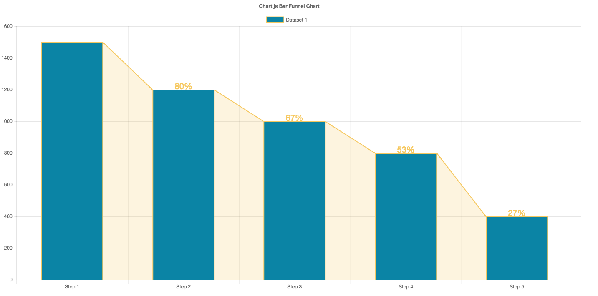

# Chart.BarFunnel.js

Provides a Bar Funnel Chart for use with [Chart.js](http://www.chartjs.org)

## Documentation

To create a Bar Funnel Chart, include `Chart.BarFunnel.js` after `Chart.js` and then create the chart by setting the `type` attribute to `'barFunnel'`

```javascript
var chart = new Chart({
	type: 'barFunnel',
	data: dataObject
});
```

### Configuration
The Bar Funnel chart colored region and step labels can be configured by placing options into the config that is passed to the chart upon creation.

```javascript
new Chart({
	config: {
		region: {
			display: true,
			borderColor: "#F6C85F",
			backgroundColor: "rgba(246, 200, 95, 0.2)"
		},

		elements: {
			rectangle: {
				stepLabel: {
					display: true,
					fontSize: 20
					// color: "red"
				}
			}
		}
	}
});
```

## Example


## License

Chart.BarFunnel.js is available under the [MIT license](http://opensource.org/licenses/MIT).

## Bugs & issues

When reporting bugs or issues, if you could include a link to a simple [jsbin](http://jsbin.com) or similar demonstrating the issue, that would be really helpful.
